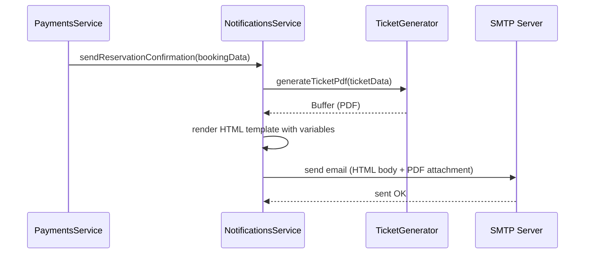

# Email Notification & PDF Ticket — Analysis & Implementation Plan

## Overview

After a successful seat reservation (payment confirmed), the system sends a confirmation email to the user with:
- A beautifully designed HTML email body
- A PDF ticket attachment generated in-memory (not saved to disk)

---

## 1. SMTP Email (Nodemailer)

### Configuration

| Env Variable | Description | Example |
|---|---|---|
| `SMTP_HOST` | SMTP server hostname | `smtp.example.com` |
| `SMTP_PORT` | SMTP port | `587` |
| `SMTP_SECURE` | Use TLS | `false` (STARTTLS on 587) |
| `SMTP_USER` | Auth username | `triqutran@gmail.com` |
| `SMTP_PASS` | Auth password/app password | `********` |
| `SMTP_FROM_NAME` | Display name | `Reservation Seats` |
| `SMTP_FROM_EMAIL` | From address | `triqutran@gmail.com` |

### Package

- **nodemailer** — battle-tested Node.js SMTP library
- **@types/nodemailer** — TypeScript types

### Architecture

```
src/modules/notifications/
├── notifications.module.ts
├── notifications.service.ts      ← sends emails via SMTP
├── templates/
│   └── reservation-confirmed.html  ← HTML email template
└── pdf/
    └── ticket-generator.ts       ← generates PDF buffer in-memory
```

---

## 2. HTML Email Template

### Design Goals

- Mobile-responsive (max-width: 600px centered table layout)
- Brand colors, clean typography
- Shows: seat number, booking ID, transaction reference, date/time, user name
- Footer with support contact

### Template Strategy

- Static HTML file with `{{placeholder}}` variables
- Replaced at runtime using simple string interpolation (no heavy template engine needed)
- Inline CSS (email clients strip `<style>` tags)

### Template Variables

| Variable | Source |
|---|---|
| `{{userName}}` | user.name |
| `{{userEmail}}` | user.email |
| `{{seatNumber}}` | seat.seatNumber |
| `{{bookingId}}` | booking.id |
| `{{transactionNo}}` | payment.napasTransactionNo or mock txn |
| `{{amount}}` | payment.amount formatted |
| `{{confirmedAt}}` | timestamp |

---

## 3. PDF Ticket Generation (In-Memory)

### Package

- **pdfkit** — lightweight PDF generation in Node.js, outputs to streams/buffers
- **@types/pdfkit** — TypeScript types

### Approach

1. Create a `PDFDocument` instance
2. Pipe to an in-memory buffer (no file system write)
3. Draw ticket layout: logo area, booking details, QR-like reference, border styling
4. Return `Buffer` to be attached directly to the email

### Ticket Content

- Title: "Reservation Ticket"
- Seat number (large, prominent)
- Booking reference ID
- Transaction number
- User name & email
- Date/time of confirmation
- Amount paid
- A note: "Present this ticket at the venue"

### Buffer Strategy (no disk save)

```typescript
function generateTicketPdf(data: TicketData): Promise<Buffer> {
  return new Promise((resolve, reject) => {
    const doc = new PDFDocument();
    const chunks: Buffer[] = [];
    doc.on('data', (chunk) => chunks.push(chunk));
    doc.on('end', () => resolve(Buffer.concat(chunks)));
    doc.on('error', reject);
    // ... draw content ...
    doc.end();
  });
}
```

---

## 4. Integration Point

### When to trigger

Inside `PaymentsService.confirmPayment()` — after the booking status is set to `confirmed`:

```
confirmPayment() 
  → update payment status to 'success'
  → update booking status to 'confirmed'
  → update seat status to 'reserved'
  → ** send confirmation email with PDF attachment **
```

### Flow



### Error Handling

- Email sending should **not** block or fail the payment confirmation
- Use `try/catch` around the notification call; log errors but don't throw
- Consider queuing (future enhancement) for retry on SMTP failures

---

## 5. Implementation Steps

| # | Task | Files |
|---|---|---|
| 1 | Add env vars to `env.validation.ts` and `.env.example` | `config/env.validation.ts` |
| 2 | Install `nodemailer`, `@types/nodemailer`, `pdfkit`, `@types/pdfkit` | `package.json` |
| 3 | Create `notifications.module.ts` | `modules/notifications/` |
| 4 | Create `ticket-generator.ts` (PDF buffer) | `modules/notifications/pdf/` |
| 5 | Create HTML email template file | `modules/notifications/templates/` |
| 6 | Create `notifications.service.ts` (SMTP + template + PDF) | `modules/notifications/` |
| 7 | Inject `NotificationsService` into `PaymentsService` | `modules/payments/` |
| 8 | Call notification after `confirmPayment` succeeds | `payments.service.ts` |
| 9 | Register `NotificationsModule` in `AppModule` | `app.module.ts` |

---

## 6. Key Decisions

| Decision | Rationale |
|---|---|
| Nodemailer over SES/SendGrid | Direct SMTP with `triqutran@gmail.com` as specified |
| PDFKit over Puppeteer | Lightweight, no headless browser needed, pure Node.js |
| In-memory buffer | No file I/O, no cleanup needed, direct attachment |
| Inline HTML template | Email clients don't support external CSS; simple `{{var}}` replacement avoids dependencies |
| Fire-and-forget notification | Payment confirmation must not fail due to email issues |

---

## 7. Email Template Preview (Simplified Structure)

```html
<!-- 600px centered table -->
<table width="600" align="center">
  <!-- Header: brand color bar + title -->
  <tr><td style="background:#2563eb;color:#fff;padding:24px">
    🎫 Reservation Confirmed
  </td></tr>
  
  <!-- Body: greeting + details -->
  <tr><td style="padding:32px">
    <p>Hi {{userName}},</p>
    <p>Your seat has been successfully reserved!</p>
    
    <!-- Details card -->
    <table style="background:#f9fafb;border-radius:8px;padding:16px">
      <tr><td>Seat</td><td><strong>#{{seatNumber}}</strong></td></tr>
      <tr><td>Booking ID</td><td>{{bookingId}}</td></tr>
      <tr><td>Transaction</td><td>{{transactionNo}}</td></tr>
      <tr><td>Amount</td><td>{{amount}} VND</td></tr>
      <tr><td>Date</td><td>{{confirmedAt}}</td></tr>
    </table>
    
    <p>Your ticket is attached as a PDF.</p>
  </td></tr>
  
  <!-- Footer -->
  <tr><td style="padding:16px;color:#6b7280;font-size:12px">
    Questions? Contact support@reservtion-seats.com
  </td></tr>
</table>
```

---

## 8. PDF Ticket Layout

```
┌──────────────────────────────────────┐
│          RESERVATION TICKET          │
│                                      │
│   ┌────────────────────────────┐     │
│   │        SEAT #{{N}}         │     │
│   └────────────────────────────┘     │
│                                      │
│   Passenger:  {{userName}}           │
│   Email:      {{userEmail}}          │
│   Booking:    {{bookingId}}          │
│   Transaction:{{transactionNo}}      │
│   Amount:     {{amount}} VND         │
│   Date:       {{confirmedAt}}        │
│                                      │
│   ─────────────────────────────      │
│   Present this ticket at the venue   │
└──────────────────────────────────────┘
```
